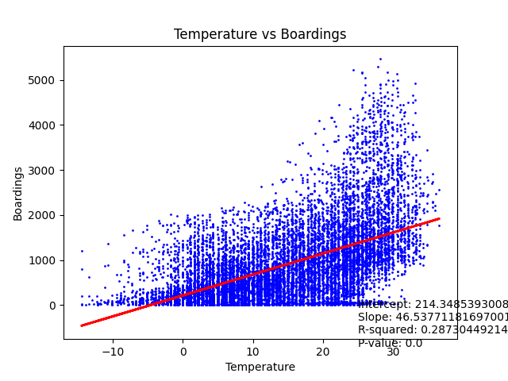

## About
Python script to see if there is a correlation between the temperature and how many people board NYC Ferry

## Data Sources:
Ferry Data: Acquired from [NYC Open Data](https://data.cityofnewyork.us/Transportation/NYC-Ferry-Ridership/t5n6-gx8c/about_data)

Weather Data: Historical Weather Data aquired from [Visual Crossing](https://www.visualcrossing.com/)
